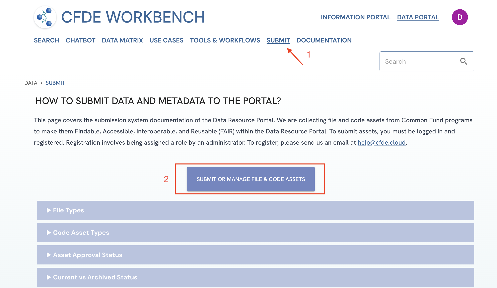
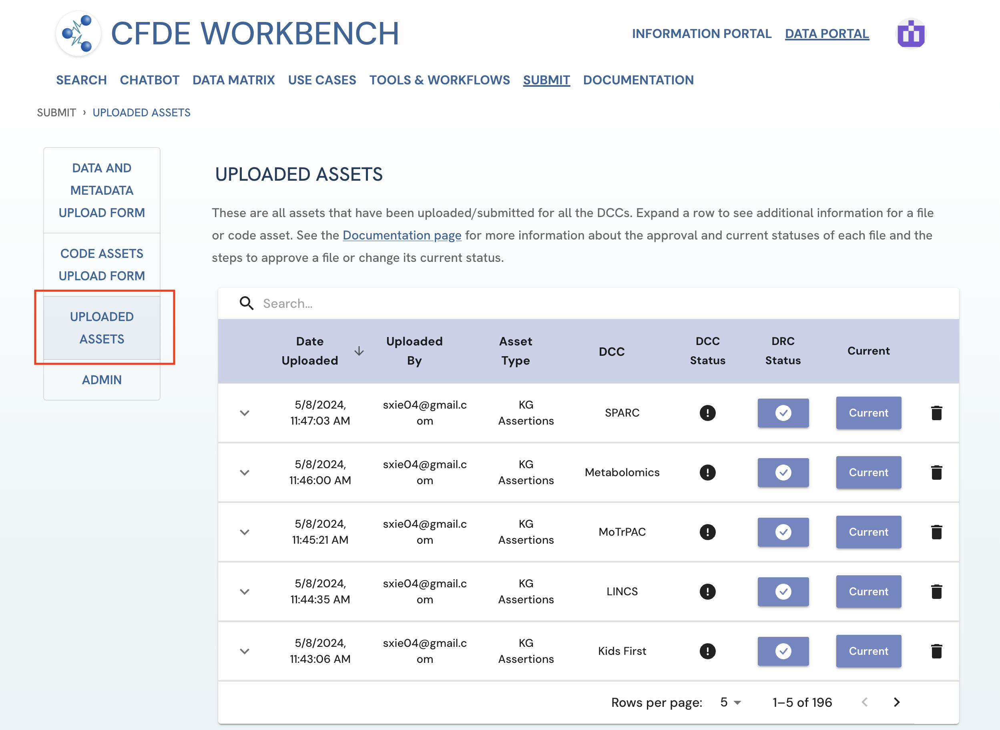
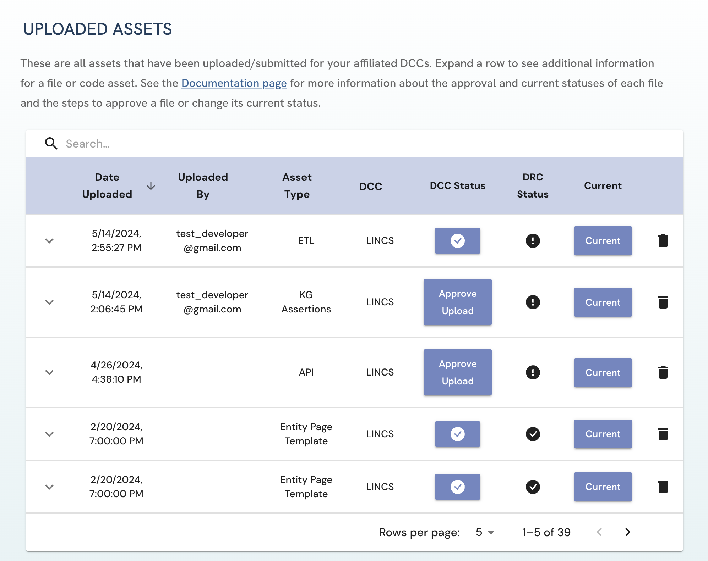
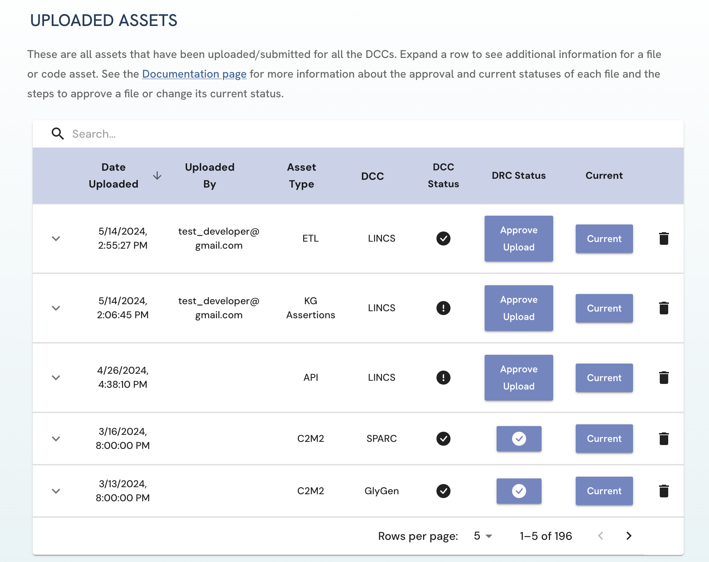
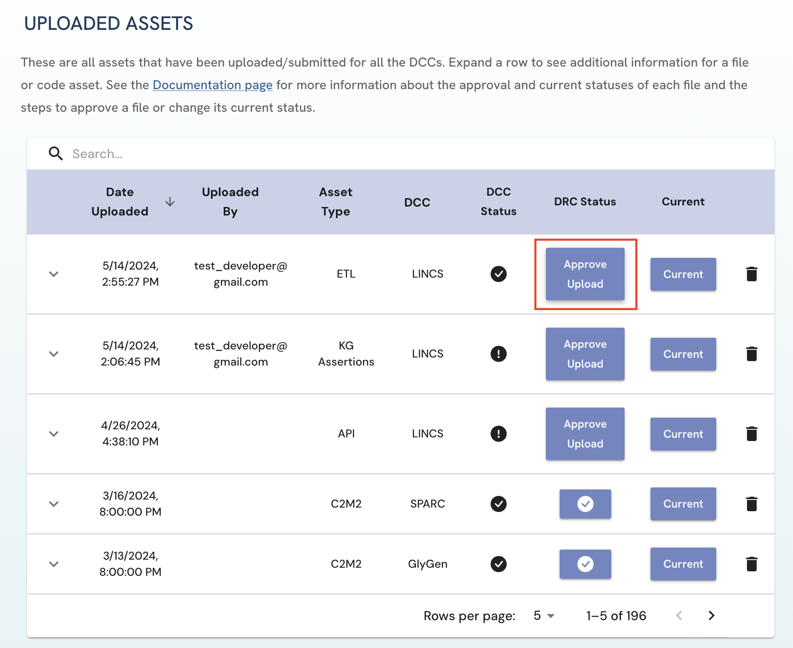
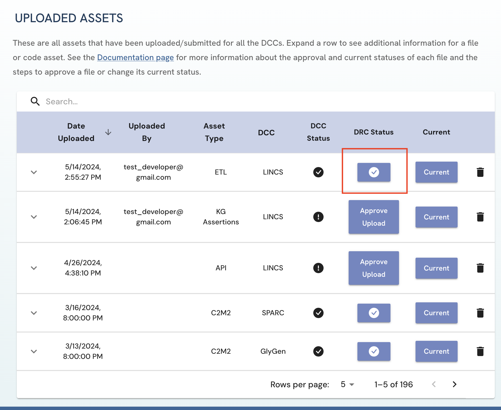
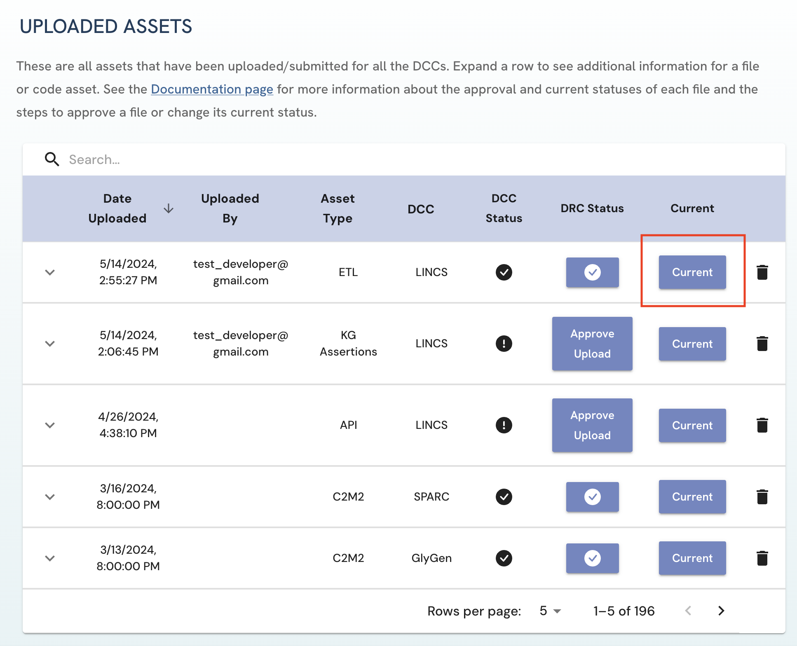
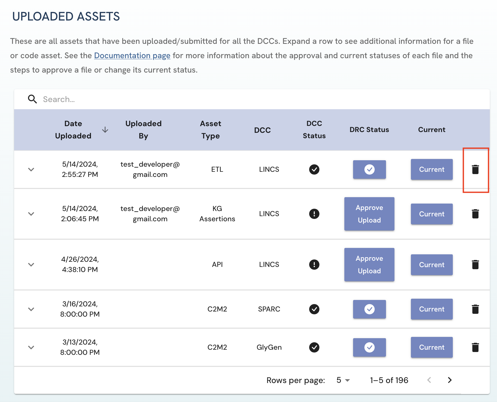

# Management of Submitted Assets (Approving,  Deleting and Archiving)

## Approving Submitted Assets
1. Go to the Uploaded Assets page. This page can be found by  clicking on the “Submit” tab in the navigation bar or in the footer, clicking on the "Submit and Manage File/Code Assets" button on the Submit page and on the *Uploaded Assets* tab 
    
    ##### Figure 1: A screenshot of Data Portal showing navigation to Code Assets Upload Form. 
    
    ##### Figure 2: A screenshot of Submission System showing navigation to Code Assets Upload Form. 

2. Here you will find all uploaded assets that fall under your jurisdiction. 

3. All unapproved assets that you are authorized to approve will be marked by the “Approve Upload” button under the DCC status or DRC status columns for DCC and DRC Approvers respectively. 

    - For DCC Approvers, these are all assets that have been uploaded or submitted for your DCC. 
        
        ##### Figure 3: A screenshot of Uploaded Assets page in the view of a LINCS DCC Approver. 

    - For DRC Approvers, these are all assets that have been uploaded/submitted by uploaders across all DCCs. 
        
        ##### Figure 4: A screenshot of Uploaded Assets page in the view of a DRC Approver. 

4. To approve an asset, click on the “Approve Upload” button to approve the file. 
    
    ##### Figure 5: A screenshot of Uploaded Assets page showing approval of a submitted asset. 

5. To remove the approved status of a asset, click on the button under the DCC/DRC status column. This reverses the Approval action. 
    
    ##### Figure 6: A screenshot of Uploaded Assets page showing approval removal of a submitted asset. 

## Archiving Submitted Assets
Similar steps are done to set an asset as the most current version. 
    - To toggle between setting an asset as Current and Archived, click on the button under Current column. Please note that:
        - Multiple assets of the same asset type can be set as current for a DCC. 
        - DCC and DRC approvers are authorized to change the current status of assets for affiliated DCCs/all DCCs respectively.
        
   ##### Figure 7: A screenshot of Uploaded Assets page showing changing archived/current status of a submitted asset. 

## Deleting Submitted Assets
Both Uploaders and Approvers can delete uploaded assets.
1. On the Uploaded Assets page, click on the delete icon next to the asset you wish to delete.
2. A pop up will appear verifying your decision to delete the given asset. 
3. Click on "Yes, Delete" to confirm the deletion of the asset. **Please note that the delete operation is permanent**.
    
    ##### Figure 8: A screenshot of Uploaded Assets page showing deleting submitted asset. 

4. **For DCC and DRC approvers**: If a current asset is deleted, please update the current status of the otherwise most up-to-date DCC asset of that type.

## Troubleshooting/FAQ: 
1. If you are to be a DCC or DRC Approver and have “Access Denied” on the Uploaded Assets page, please contact the DRC through email to change your role and grant you access.
2. If a DCC that you are affiliated with is not listed as one of your DCC options on the My Account page, please contact the DRC through email to update your information. You will not be allowed to approve uploaded files for this DCC otherwise.
