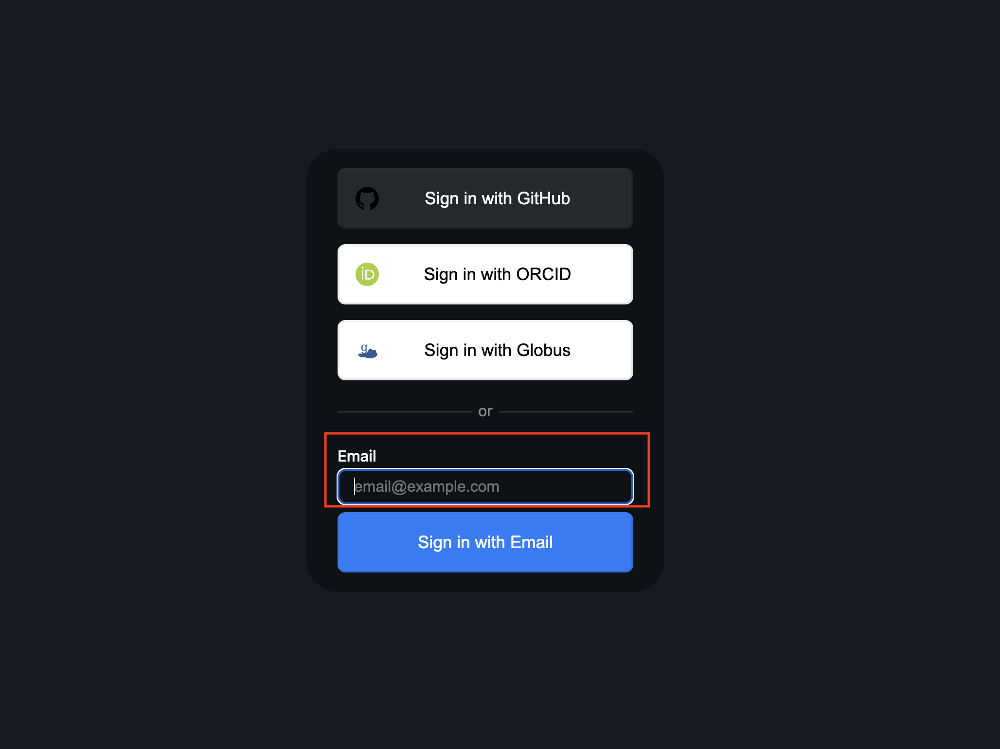
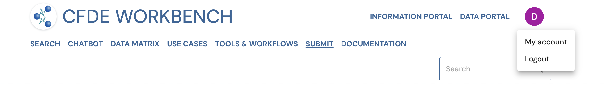

# Onboarding to the Data Portal Submission System

### <u>User Roles</u>

As a Common Fund Data Coordinating Center (DCC) you have 3 role options for your users of the submission system:

- User: This is a general user of the platform who cannot upload, approve, or view non-public files. You can have as many users in this role as you want.
- Uploader: Can submit data packages, but can't approve data packages/files. Users can see files that they submitted for their DCC, but can't approve them. You can have as many users in this role as you want.
- Approver: Can submit new packages and approve a submitted package. You can have as many users in this role as you want.

Any given person in your DCC can only have 1 role. 

### <u>Onboarding Process</u>
To do onboarding and give a member of your DCC Approver or Uploader privileges, have the PI or PM of your DCC contact the DRC via email ([help@cfde.cloud](help@cfde.cloud)) with the following information about the concerned members: 
- Name
- Email
- Role
- DCC 

Please also indicate if the user has previously logged into the portal (has a user account) or has never accessed the portal (is a new user). 

When the user(s) have been registered, each of them will receive an email from a member of the DRC notifying them of their registration.  

### <u>Logging into the Portal after Registration</u>
1. You can log into the portal by entering the email address you were registered with into the email field here: 
2. You will be sent a registration confirmation link to that email. If you do not find the link in your inbox, please also check your spam folder as the email may be sent there. 
    
    ##### Figure 1: A screenshot of login page.

### <u>Verifying Account Information</u>
Before submitting or approving assets, please go to My Account page and verify that all the role and DCC information is correct. 
Go the My Account page by clicking on the user icon on the top right of the screen and click on My Account. 

##### Figure 2: A screenshot of Data Portal showing navigation to My Account page. 

If your email is missing (you logged into the portal using ORCID): 
1. If you were registered with your email, log out of the portal and sign in with the email you were registered with. 
2. Otherwise, please enter your email and press save changes or the enter key. **Please note that your email can only be saved once so be careful to ensure that it is accurately entered**.